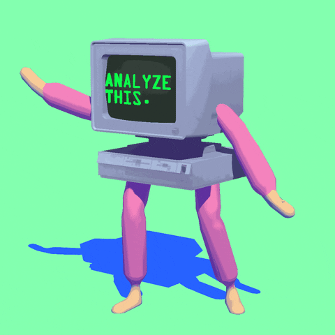
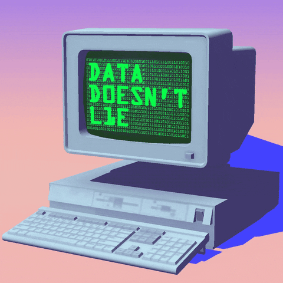

# 👋 Hi, I'm Bruce Yi

**AI Product Builder · Open-source Collaborator · Agent Systems**

I work inside fast-moving AI open-source projects — shaping product behavior, integration contracts, developer workflows, and upstream implementations through code, design discussion, and cross-PR review.

  
  
  
  

<!-- holographic animations: demos from LAWTED/holographic-sticker -->

  
  

## What I work on

<table>
  <tr>
    <td width="33%" valign="top">
      <b>⚡ Laya · breakout AI project</b>  
      4 merged upstream PRs. 
      Product / API contract discussions. 
      Staged-adoption & integration design. 
      Cross-PR reviews that changed serving, batching, and evaluation implementations.
        
      <a href="https://github.com/NandhaKishorM/laya/pulls?q=is%3Apr+author%3ABruce-Yii">View contributions →</a>
    </td>
    <td width="33%" valign="top">
      <b>🧠 Qwen & ModelScope ecosystem</b>  
      QwenPaw upstream product/UX work. 
      EvalScope multimodal & evaluation contributions. 
      FunASR Nano timestamp correctness across offline / vLLM / pipeline paths.
        
      <a href="https://github.com/agentscope-ai/QwenPaw/pull/7593">QwenPaw</a> ·
      <a href="https://github.com/modelscope/evalscope/pull/1729">EvalScope</a> ·
      <a href="https://github.com/modelscope/FunASR/pull/3703">FunASR</a>
    </td>
    <td width="33%" valign="top">
      <b>🛠️ Agent & AI infrastructure</b>  
      Repeated upstream work across OpenClaw, Dify, Cherry Studio, RAGFlow and other AI OSS. 
      Focused on reliability, context integrity, RAG fidelity, workflow UX, and agent runtime behavior.
        
      <a href="https://github.com/search?q=author%3ABruce-Yii+is%3Apr+is%3Amerged&type=pullrequests">All merged PRs →</a>
    </td>
  </tr>
</table>

## Selected upstream impact

| Project | Contribution | Product / user impact |
| --- | --- | --- |
| **Laya** | [#224](https://github.com/NandhaKishorM/laya/pull/224) · [#292](https://github.com/NandhaKishorM/laya/pull/292) · [#328](https://github.com/NandhaKishorM/laya/pull/328) · [#115](https://github.com/NandhaKishorM/laya/pull/115) | Protect recent conversational intent, correct routing semantics, clarify full-conversation integration contracts, recover real requests hidden by email disclaimers |
| **FunASR** | [#3703](https://github.com/modelscope/FunASR/pull/3703) | Correct Fun-ASR-Nano punctuation timestamps across VAD merges with real-tokenizer regression coverage |
| **OpenClaw** | [4 merged PRs](https://github.com/openclaw/openclaw/pulls?q=is%3Apr+author%3ABruce-Yii+is%3Amerged) | Gateway repair, CLI behavior, local inference, setup reliability |
| **Dify** | [3 merged PRs](https://github.com/langgenius/dify/pulls?q=is%3Apr+author%3ABruce-Yii+is%3Amerged) | RAG ingestion fidelity, moderation behavior, annotation CSV data integrity |
| **Cherry Studio** | [4 merged PRs](https://github.com/CherryHQ/cherry-studio/pulls?q=is%3Apr+author%3ABruce-Yii+is%3Amerged) | Agent runtime proxy behavior, Gemini tool-schema handling, binary-manager state correctness, and rich Excel clipboard interoperability |
| **RAGFlow** | [4 merged PRs](https://github.com/infiniflow/ragflow/pulls?q=is%3Apr+author%3ABruce-Yii+is%3Amerged) | Agent message semantics plus retrieval / model utility coverage |
| **QwenPaw** | [#7593](https://github.com/agentscope-ai/QwenPaw/pull/7593) | Restored direct workspace path input while preserving picker and validation behavior |
| **EvalScope** | [#1729](https://github.com/modelscope/evalscope/pull/1729) · [#1720](https://github.com/modelscope/evalscope/pull/1720) | Real multi-image MMMU evaluation flow and more reliable import semantics |

> **Current footprint:** 38 merged PRs across 14 external upstream repositories.
> I care more about useful project behavior and maintainer trust than raw PR count.

## How I contribute

- **Product first** — start from the user / developer failure mode, not from “what code can I change?”
- **Contract before code** — when behavior is ambiguous, align API / product semantics with maintainers before expanding scope.
- **Small surface, hard evidence** — reproduce, keep the change bounded, test the real boundary, and avoid unsupported claims.
- **Review beyond my own PRs** — inspect other contributors’ work for lifecycle, compatibility, integration, and product-contract issues.
- **Reuse before rebuild** — prefer existing primitives and ecosystem capabilities; only add new machinery when the gap is real.

## Current collaboration tracks

**Laya** — staged adoption, CLI / MCP docs, product-contract and integration discussions
**ModelScope / EvalScope / FunASR** — evaluation, multimodal workloads, Agent evaluation, ASR correctness
**OpenClaw / Dify / Cherry Studio / RAGFlow** — agent runtime, developer workflow, RAG / context fidelity
**n8n and other AI OSS** — active upstream contribution and review

## Recent OSS activity

<!-- OSS-ACTIVITY:START -->
- 2026-09-25 — `CherryHQ/cherry-studio#21031` merged — fix(composer): prefer text for rich Excel clipboard pastes
- 2026-09-25 — `modelscope/FunASR#3703` merged — fix(nano): correct punctuation timestamps across VAD merges
- 2026-09-24 — `NandhaKishorM/laya#328` merged — docs(langchain): document full-conversation state extraction
- 2026-09-24 — `NandhaKishorM/laya#292` merged — fix(router): blank/whitespace explicit lang falls through to detection
- 2026-09-23 — `CherryHQ/cherry-studio#20946` merged — fix(dsh-runtime): inherit applied proxy env into the dsh child
<!-- OSS-ACTIVITY:END -->

> Auto-updated activity can overwrite only the block above; the rest of this profile is intentionally curated.

## Contributions

  

<picture>
  <source media="(prefers-color-scheme: dark)" srcset="https://raw.githubusercontent.com/Bruce-Yii/Bruce-Yii/main/dist/github-snake-dark.svg" />
  
</picture>
