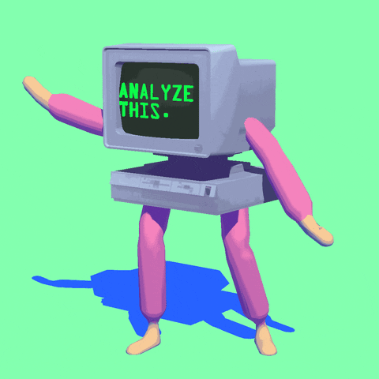
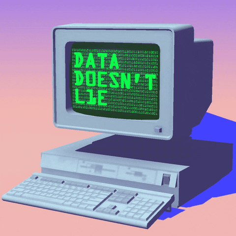

# 👋 Hi, I'm Bruce Yi

**AI Product Builder · Open-source Collaborator · Agent Systems**

I work across AI open-source projects on product behavior, integration contracts, developer workflows, and implementation work.

  
  
  
  

<!-- holographic animations: demos from LAWTED/holographic-sticker -->

  
  

<!-- Official project marks are hotlinked from repository-owned assets pinned to immutable upstream commits, with official GitHub org avatars used only where a compact repository mark is unavailable. -->
## OSS Constellation

<table width="100%" style="width:100%; table-layout:fixed;">
  <tr>
    <td width="25%" align="center" valign="middle">
      <a href="https://github.com/NandhaKishorM/laya/pulls?q=is%3Apr+author%3ABruce-Yii"> <b>Laya  </b></a>
    </td>
    <td width="25%" align="center" valign="middle">
      <a href="https://github.com/agentscope-ai/QwenPaw/pull/7593"> <b>Qwen Paw</b></a>
    </td>
    <td width="25%" align="center" valign="middle">
      <a href="https://github.com/modelscope/evalscope/pull/1729"><picture><source media="(prefers-color-scheme: dark)" srcset="https://raw.githubusercontent.com/modelscope/evalscope/06b4c67bc37d5482bdcca8b7a3dee335b9e6b5a7/docs/en/_static/images/evalscope_icon_dark.png" /></picture> <b>Eval Scope</b></a>
    </td>
    <td width="25%" align="center" valign="middle">
      <a href="https://github.com/modelscope/FunASR/pull/3703"> <b>FunASR  </b></a>
    </td>
  </tr>
  <tr>
    <td width="25%" align="center" valign="middle">
      <a href="https://github.com/openclaw/openclaw/pulls?q=is%3Apr+author%3ABruce-Yii+is%3Amerged"> <b>Open Claw</b></a>
    </td>
    <td width="25%" align="center" valign="middle">
      <a href="https://github.com/langgenius/dify/pulls?q=is%3Apr+author%3ABruce-Yii+is%3Amerged"> <b>Dify  </b></a>
    </td>
    <td width="25%" align="center" valign="middle">
      <a href="https://github.com/CherryHQ/cherry-studio/pulls?q=is%3Apr+author%3ABruce-Yii+is%3Amerged"> <b>Cherry  </b></a>
    </td>
    <td width="25%" align="center" valign="middle">
      <a href="https://github.com/infiniflow/ragflow/pulls?q=is%3Apr+author%3ABruce-Yii+is%3Amerged"> <b>RAG Flow</b></a>
    </td>
  </tr>
</table>

## Featured collaborations

<table width="100%">
  <tr>
    <td width="84" align="center" valign="middle">
      
    </td>
    <td valign="top">
      <b>Laya</b> 
      Product contracts · adoption · review 
      21 merged PRs · 60 PRs reviewed · staged adoption 
      <a href="https://github.com/NandhaKishorM/laya/pulls?q=is%3Apr+author%3ABruce-Yii"><b>View work →</b></a>
    </td>
  </tr>
  <tr>
    <td width="84" align="center" valign="middle">
      
    </td>
    <td valign="top">
      <b>Qwen × ModelScope</b> 
      Agent UX · multimodal eval · speech reliability 
      QwenPaw product UX · EvalScope ×3 · FunASR Nano timestamps 
      <a href="https://github.com/agentscope-ai/QwenPaw/pull/7593"><b>Explore work →</b></a>
    </td>
  </tr>
  <tr>
    <td width="84" align="center" valign="middle">
      
       
      
      
    </td>
    <td valign="top">
      <b>Agent OSS</b> 
      Runtime · RAG · context integrity 
      OpenClaw ×5 · Dify ×4 · Cherry ×5 · RAGFlow ×4 
      <a href="https://github.com/search?q=author%3ABruce-Yii+is%3Apr+is%3Amerged&type=pullrequests"><b>All PRs →</b></a>
    </td>
  </tr>
</table>

<b>Selected upstream impact — PR evidence</b>

| Project | Contribution | Product / user impact |
| --- | --- | --- |
| **Laya** | [21 merged](https://github.com/NandhaKishorM/laya/pulls?q=is%3Apr+author%3ABruce-Yii) · [#115](https://github.com/NandhaKishorM/laya/pull/115) · [#224](https://github.com/NandhaKishorM/laya/pull/224) · [#415](https://github.com/NandhaKishorM/laya/pull/415) · [#523](https://github.com/NandhaKishorM/laya/pull/523) · [#664](https://github.com/NandhaKishorM/laya/pull/664) [60 reviewed](https://github.com/NandhaKishorM/laya/pulls?q=is%3Apr+reviewed-by%3ABruce-Yii) · [#696](https://github.com/NandhaKishorM/laya/pull/696) · [#698](https://github.com/NandhaKishorM/laya/pull/698) · [#710](https://github.com/NandhaKishorM/laya/pull/710) · [#712](https://github.com/NandhaKishorM/laya/pull/712) | Router, eval and MCP contracts plus adoption docs; review caught Python/TypeScript parity gaps, an off-by-one percentile, a wrong state-budget formula, CVE severity |
| **QwenPaw** | [#7593](https://github.com/agentscope-ai/QwenPaw/pull/7593) · [5 open](https://github.com/agentscope-ai/QwenPaw/pulls?q=is%3Apr+author%3ABruce-Yii) | Restore direct workspace path input while preserving picker and validation behavior |
| **EvalScope** | [3 merged](https://github.com/modelscope/evalscope/pulls?q=is%3Apr+author%3ABruce-Yii+is%3Amerged) · [#1720](https://github.com/modelscope/evalscope/pull/1720) · [#1729](https://github.com/modelscope/evalscope/pull/1729) · [#1768](https://github.com/modelscope/evalscope/pull/1768) | Real multi-image MMMU evaluation and more reliable import semantics |
| **FunASR** | [#3703](https://github.com/modelscope/FunASR/pull/3703) | Correct Fun-ASR-Nano punctuation timestamps across VAD merges with real-tokenizer coverage |
| **OpenClaw** | [5 merged PRs](https://github.com/openclaw/openclaw/pulls?q=is%3Apr+author%3ABruce-Yii+is%3Amerged) | Gateway repair, CLI behavior, local inference, and setup reliability |
| **Dify** | [4 merged PRs](https://github.com/langgenius/dify/pulls?q=is%3Apr+author%3ABruce-Yii+is%3Amerged) | RAG ingestion fidelity, moderation behavior, and annotation CSV integrity |
| **Cherry Studio** | [5 merged PRs](https://github.com/CherryHQ/cherry-studio/pulls?q=is%3Apr+author%3ABruce-Yii+is%3Amerged) | Runtime proxy behavior, Gemini tool schemas, binary-manager state, and rich Excel clipboard interoperability |
| **RAGFlow** | [4 merged PRs](https://github.com/infiniflow/ragflow/pulls?q=is%3Apr+author%3ABruce-Yii+is%3Amerged) | Agent message semantics plus retrieval and model-utility coverage |

> **Current footprint:** 61 merged PRs across 15 external upstream repositories, plus 60 PRs reviewed on Laya alone.
> I care about useful upstream changes and maintainer trust more than PR volume.

## How I contribute

<table width="100%">
  <tr>
    <td width="50%" valign="top"><b>Product first</b> Start from the user or developer failure mode.</td>
    <td width="50%" valign="top"><b>Contract before code</b> Align product and API semantics before expanding scope.</td>
  </tr>
  <tr>
    <td width="50%" valign="top"><b>Narrow scope, hard evidence</b> Reproduce first, keep the diff bounded, and test the actual boundary.</td>
    <td width="50%" valign="top"><b>Review beyond my own PRs</b> Check lifecycle, compatibility, integration, and product contracts.</td>
  </tr>
</table>

## Active tracks

<table width="100%">
  <tr>
    <td width="50%" valign="top"><b>Laya</b> staged adoption · CLI/MCP docs · integration contracts</td>
    <td width="50%" valign="top"><b>Qwen + ModelScope</b> agent UX · multimodal evaluation · ASR correctness</td>
  </tr>
  <tr>
    <td width="50%" valign="top"><b>Agent & AI OSS</b> runtime · RAG/context fidelity · developer workflow</td>
    <td width="50%" valign="top"><b>n8n + other AI OSS</b> upstream implementation · cross-project review</td>
  </tr>
</table>

## Contributions

  

<picture>
  <source media="(prefers-color-scheme: dark)" srcset="https://raw.githubusercontent.com/Bruce-Yii/Bruce-Yii/main/dist/github-snake-dark.svg" />
  
</picture>
